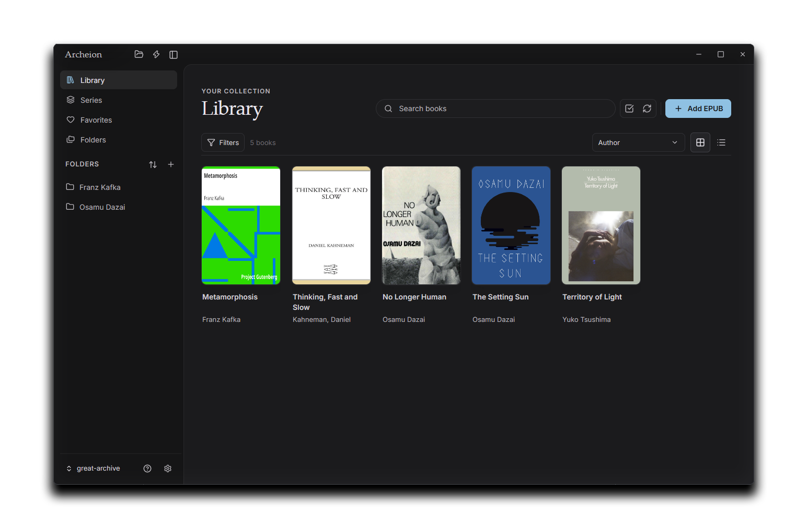

<p align="center">
  
</p>

<p align="center">
  A local-first desktop EPUB reader and archive manager.
</p>

<p align="center">
  <a href="https://tommymoonn.github.io/archeion/">Landing Site</a>
  ·
  <a href="#quick-start">Quick Start</a>
  ·
  <a href="#features">Features</a>
  ·
  <a href="#development">Development</a>
  ·
  <a href="#packaging">Packaging</a>
</p>

<p align="center">
  
</p>

---

## Landing Site

Visit the landing page: [tommymoonn.github.io/archeion](https://tommymoonn.github.io/archeion/)

## Quick Start

Clone the repository and install dependencies:

```sh
git clone https://github.com/TommyMoonn/archeion.git
cd archeion
npm install
```

Run the desktop app in development:

```sh
npm run tauri:dev
```

Open an existing EPUB folder as an archive, or create a new empty archive from the Archive Manager.

## Features

- **Local archives** - use real folders on your machine.
- **EPUB library** - scan nested folders while preserving structure.
- **Reader** - paged EPUB reading with progress restore.
- **Archive Manager** - create, open, switch, and manage archives.
- **File actions** - add, rename, move, and delete EPUBs and folders safely.
- **Metadata editing** - write title and author changes back into EPUB files.
- **Library feedback** - compact tokens for imports, rescans, folders, and deletes.
- **Settings** - reader, library, appearance, and archive preferences.

## Local-first Model

Archeion keeps EPUB files as normal files on disk.

```txt
Your Archive/
  Book.epub
  Series/
    Volume 01.epub
  .archeion/
    library.json
    progress.json
    scanner-cache.json
    settings.json
    covers/
    backups/
```

`.archeion/` stores app metadata, reading progress, cover cache, scanner hints, and writeback backups.

## Development

Requires Node.js, Rust, Cargo, and the platform prerequisites for Tauri.

```sh
npm run verify
```

Useful commands:

```sh
npm run fmt
npm run lint
npm run typecheck
npm run test
npm run build
npm run check:rust
```

## Packaging

```sh
npm run tauri:build
```

Before packaging, keep the version aligned in:

```txt
package.json
package-lock.json
src-tauri/Cargo.toml
src-tauri/tauri.conf.json
```
