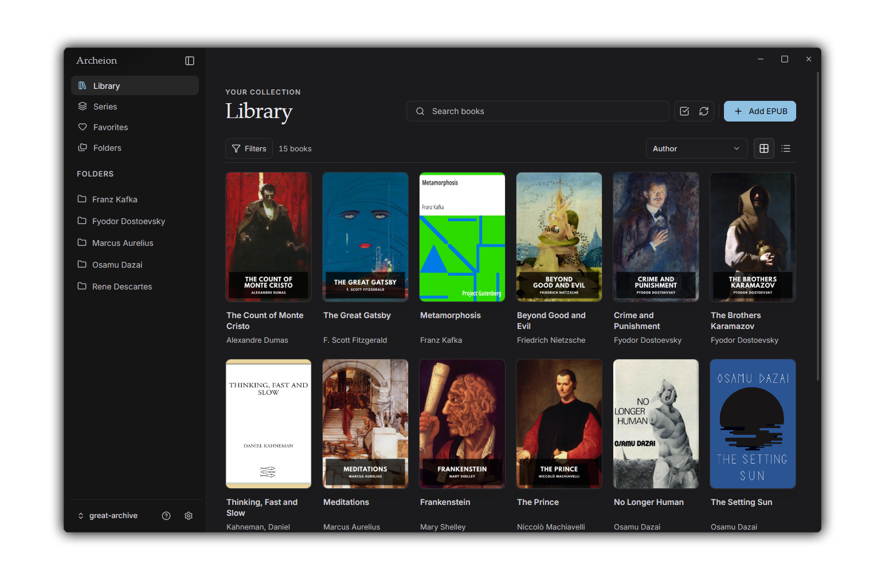

<p align="center">
  
</p>

<p align="center">
  A local-first Windows desktop app for organizing and reading EPUB libraries.
</p>

<p align="center">
  <a href="https://tommymoonn.github.io/archeion/"></a>
  <a href="https://github.com/TommyMoonn/archeion/releases/latest"></a>
  <a href="https://github.com/TommyMoonn/archeion/releases"></a>
  <a href="https://tommymoonn.github.io/archeion/documentation/changelog/"></a>
</p>

<p align="center">
  
</p>

---

## About Archeion

Archeion is my dive into agentic coding workflows. This app was mainly for my personal use, getting to explore agentic coding is a nice bonus to it.

It is a local-first EPUB library that is based on literal files on your system. So if you have a folder lying around that stores all your EPUBs (for some reason) like me, and you have a need to read it on your desktop/laptop then this app is for you. Otherwise, this app is just a nothing burger, that's the one specific use-case of this app lol.

## Transparency

I have not read or written a single line of code in here, and all of the documentation on this app are written by LLMs.

I want to make it very clear that maintanence on this app will be based on vibes (literally). All the fixes or improvements here has been from just using the app myself; finding out bugs or wanting features that improves my experience.

Still, all feedback is appreciated if there's any.

## Download Archeion

- **[Windows EXE installer](https://github.com/TommyMoonn/archeion/releases/latest/download/Archeion-Setup-x64.exe)** (recommended)
- **[Windows MSI installer](https://github.com/TommyMoonn/archeion/releases/latest/download/Archeion-x64.msi)**

### Releases

Currently, there's only support for windows systems. No Linux, macOS support yet, i'm too dumb for that right now.

See the [latest release notes](https://github.com/TommyMoonn/archeion/releases/latest)
or browse [all releases](https://github.com/TommyMoonn/archeion/releases).

## Features

- **Real folder archives** - open an existing EPUB folder or create a new archive.
- **Library organization** - browse folders and series, search, sort, filter, select, and manage books in bulk.
- **Bookmarks and highlights** - bookmark, highlight and write notes while reading.
- **EPUB metadata editing** - update a book's metadata such as its title, author, publisher, and more.
- **Customizable appearance** - you can customize the app's theme, refer to the [Custom theme documentation](https://tommymoonn.github.io/archeion/documentation/customization/custom-themes/).
- **Offline dictionaries** - install local dictionaries and look up words you don't know.

## Local-first

An "archive" is literally just a folder on your system, so the books are just the `.epub` files under that folder. Each "archive" contains a `.archeion` folder that stores data such as reading progress, annotations/bookmarks, etc.

`.archeion` file structure:

```txt
Your Archive/
├── Meditations.epub
├── Series/
│   └── Crime and Punishment.epub
└── .archeion/
    ├── annotations.json
    ├── library.json
    ├── progress.json
    ├── scanner-cache.json
    ├── covers/
    └── backups/
        ├── annotations/
        ├── epub-writeback/
        ├── library/
        ├── progress/
        └── scanner-cache/
```

## Project documentation

> [!IMPORTANT]
> All of the documentation here are written by LLMs.

- [Development guide](docs/DEVELOPMENT.md)
- [Project scripts](scripts/README.md)
- [Changelog](CHANGELOG.md)

## License

Archeion is licensed under the [GNU General Public License v3.0 only](LICENSE).
